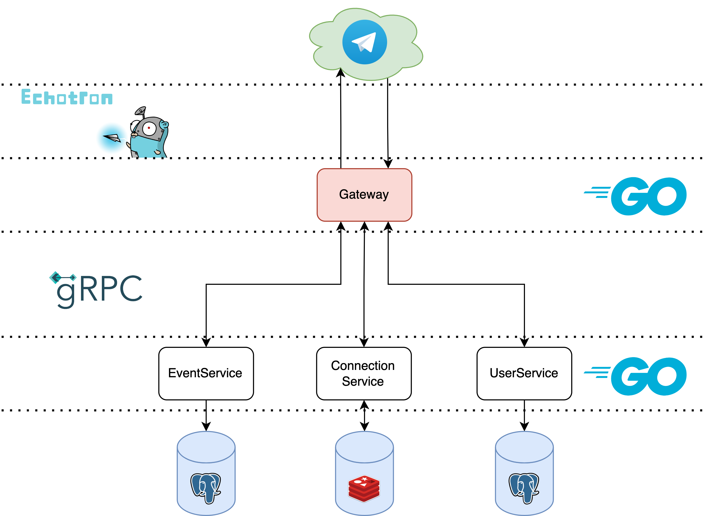

# gsSportBot - Telegram Bot for Sports Events Administration

gsSportBot is a Telegram bot designed for the administration of sports events. The bot functions like a small app with a microservice architecture. This readme file provides an overview of the bot's architecture, its microservices, and what needs to be done to complete it.

## Architecture
The gsSportBot has a microservice architecture that includes three microservices:
- [UserService](https://github.com/hovhannesyan/gsSportBot_UserService): Responsible for handling user-related operations, such as registration, login, and user management.
- [EventService](https://github.com/hovhannesyan/gsSportBot_EventService): Responsible for handling event-related operations, such as creating, updating, and deleting events.
- [ConnectionService](https://github.com/hovhannesyan/gsSportBot_ConnectionService): Responsible for handling the connection between the UserService and EventService.

## Need to do
Although gsSportBot is not ready for use, some things need to be done to complete it. Here are the necessary steps:
1. Implement a handler that allows admins to delete events they created.
2. Add logger to the bot to log all errors and exceptions.
3. Implement error handlers to handle cases where the bot encounters errors or exceptions.
4. Optimize the code for better performance and maintainability.
5. Write a Dockerfile to package the bot as a Docker container and deploy it to the cloud.
